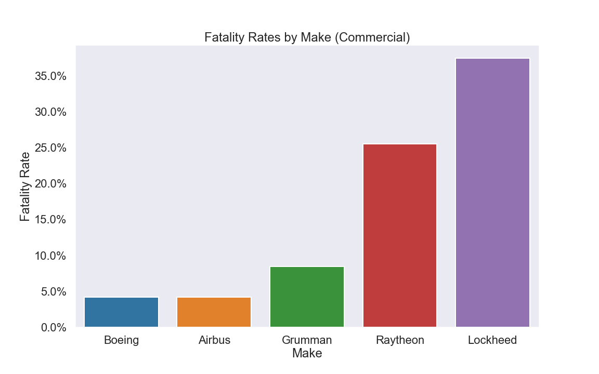

# Aircraft Risk Analysis

**Authors**: Will Bennet, James Meredith

## Overview

The purpose of this data analysis project was to determine recommendations on potential  aircraft for a company to expand its business portfolio into. Aircraft types were broadly divided into two categories based on size and use-case: 1) large-size commercial aircraft to be used for commercial flights, and 2) small-size private aircraft for use as rentals, flight school instruction vehicles, and as air taxis. To analyze the aircraft models that posed the lowest risk of investment, records of over 90,000 aviation accidents from 1948 to 2022 compiled by The National Transportation Safety Board were used to examine safety and viability of investment. Our analysis focused on reduction of investment risk by prioritizing model safety and minimization of potential liability due to fatality in the event of a crash. Because the dataset only contained information on crashes that had occurred, and NOT on the relative frequency of incidence of said crashes for each aircraft model, our analysis focused on what's referred to in the aviation industry as "Passive Safety" features in each aircraft - features of an aircraft that protect passengers in the event of an accident - rather than on "Active Safety" features, features of an aircraft that help the pilot avoid an accident in the first place. Results of the analysis revealed the lowest incidence of fatality in Boeing- and Airbus-manufactured large-size commercial aircraft, and Diamond-manufactured small-size aircraft. Based on the analysis the authors recommend the Boeing 737, 747, and Airbus A320 as the most fitting models in the large-size commercial-use category, and the Diamond 20, 40, 42, the Cessna 172, and the Piper PA28 in the small-size category.

## Business Problem

A company is expanding into new industries in order to diversify its portfolio. Specifically, they are interested in purchasing and operating airplanes for commercial and private enterprises, but do not know anything about the potential risks of aircraft. Our team was charged with determining which aircraft are the lowest risk for the company to start this new business endeavor.

## Data

Data from the National Transportation Safety Board's Aviation Accident Database was used to examine safety and viability of potential investment aircraft. The database contained of over 90,000 recorded aviation accidents from 1948 to 2022.

## Methods

Our analysis focused on reduction of investment risk by prioritizing model safety and minimization of potential liability due to fatality in the event of a crash. Because the dataset only contained information on crashes that had occurred, and NOT on the relative frequency of incidence of said crashes for each aircraft model, our analysis focused on what's referred to in the aviation industry as "Passive Safety" features in each aircraft - features of an aircraft that protect passengers in the event of an accident - rather than on "Active Safety" features, features of an aircraft that help the pilot avoid an accident in the first place.
***

## Results

Results of the analysis revealed the lowest incidence of fatality in Boeing- and Airbus-manufactured large-size commercial aircraft, and Diamond-manufactured small-size aircraft.

### Interactive Dashboard (Tableau):
[Interactive Dashboard](https://public.tableau.com/views/Aircraft-Risk-Analysis/Dashboard1?:language=en-US&publish=yes&:display_count=n&:origin=viz_share_link)

### Falatilites by Make (Commercial):


### Fatalities by Make (Private):


## Conclusions

Based on the analysis the authors recommend the Boeing 737, 747, and Airbus A320 as the most fitting models in the large-size commercial-use category, and the Diamond 20, 40, 42, the Cessna 172, and the Piper PA28 in the small-size category. To solidify our recommendations, next steps for the analysis would be to calculate active safety metrics for each model by comparing our data to total incident-free per-model flight hours, and to analyze cost data in order to calculate investment risk from a monetary standpoint.

## For More Information

Please review our full analysis in [our Jupyter Notebook](./aviation-analysis.ipynb), [our Interactive Dashboard](https://public.tableau.com/views/Aircraft-Risk-Analysis/Dashboard1?:language=en-US&publish=yes&:display_count=n&:origin=viz_share_link), or [our presentation](./presentation.pdf).

For any additional questions, please contact Will Bennett at wbennett711@gmail.com and James Meredith at jam637.jlm@gmail.com

## Repository Structure

```
├── __init__.py
├── README.md
├── aviation-analysis.ipynb
├── presentation.pdf
├── code_package
│   ├── __init__.py
│   ├── visualizations.py
│   ├── data_preparation.py
│   └── eda_notebook.ipynb
├── data
└── images
```
